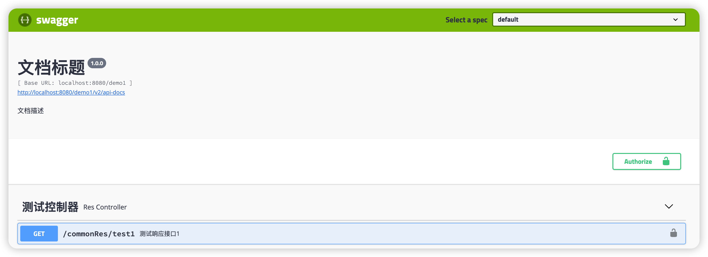

# wx-boot

# 一、介绍

wx-boot 是一个专为 Java 开发者设计的快速搭建微服务的脚手架，旨在帮助开发者快速构建高效、可靠的微服务架构，无论你是初学者还是经验丰富的开发者，跟着文档说明走，都能够快速上手即用！

wx-boot集成了多个关键组件和技术，包括 Spring Gateway、ZooKeeper、Dubbo、Redisson 和 Hystrix等，同时提供了 Docker 和 Kubernetes (K8s) 部署支持。

## 不是纯粹的集成库

wx-boot不是纯粹的框架集成库，还提供了多维度的鉴权管理、用户管理、日志采集等功能，以及许多便捷的开发辅助封装，帮助开发者快速搭建自己的服务，如kafka、rabitmq的可靠性处理约束、延时双删、分布式锁接入、主从节点选举、请求响应体规范、异常处理、日志处理、实体约束等一系列辅助功能，下面都会一一介绍。

## 不仅仅是一个脚手架

wx-boot不仅仅是一个脚手架工程，也是一个完整的微服务构建部署方案，并提供了相关组件部署开发说明，尽量减少开发者的上手难度。

1、针对zookeeper、nginx、mysql、redis等需要额外安装配置的中间件，也提供了对应的docker-compose实现，后续也会补充k8s的实现。对docker、docker-compose、k8s等都不熟悉？没关系，在这个项目后续也会有教程一一教会你如何部署使用。

2、对于ELK、SkyWalking、Prometheus、Arthas等同样有使用门口的组件，这里同样会提供相关的部署开发教程，帮助开发者快速搭建自己的服务生态。

# 二、架构图

注意，并不是要求所有开发者都按照如下架构进行搭建，如ELK日志采集、链路追踪、监控等都是不是必须的，开发者根据自身情况选配，这个架构图仅仅提供了作者对微服务整套体系搭建的一个思路。


# 三、工程结构

目前项目仍在完善，这是部分已实现和待实现的结构目录

```
.
├── wx-common #通用包
│   ├── wx-common-core #核心工具包	
│   ├── wx-common-lock #分布式锁
│   │   └── wx-common-lock-redis #分布式锁,redisson实现
│   ├── wx-common-master #主从节点选举
│   │   └── wx-common-master-redis #redis实现主从选举
│   │		└── wx-common-master-starter-redis #redis实现主从选举starter
│   ├── wx-common-redis #redis工具包
│   ├── wx-common-swagger #swagger工具包
│   ├── wx-common-web #web相关工具包
│   ├── wx-common-log #log相关工具包
│   ├── wx-common-mybatis-plus #mybatis-plus相关工具包
│   └── wx-common-security #安全模块相关工具
├── wx-gateway  #网关，待实现
├── wx-demo #演示工程
└── wx-services #服务
    ├── wx-auth #鉴权服务，待实现
    └── wx-usercenter #用户中心，待实现
```

# 四、功能说明

​	这一节我将介绍wx-boot协助开发者快速开发的一系列脚手架功能，作者认为一个好用的工具，应该还有完备的使用文档，由于该项目刚开始搭建，所以需要时间来完善文档和功能；本节介绍的功能集中在common包下，目前作者优先提供这部分功能，后续其他预期功能任在开发建设中。

​	已经补充响应体、异常处理、swagger快速配置使用、主从选举和心跳管理、分布式锁、延时双删等说明，仍有一部分内容需要完善和文档补充。

## 响应体

统一的响应体处理，无需再拼接统一响应体

```java
@RequestMapping("/commonRes")
@RestController
public class ResController {

		//这里的返回可以是任意数据实体，不局限于Map类
    @GetMapping("/test1")
    public Map<String, Object> test1() {
        Map<String, Object> res = new HashMap<>();
        res.put("key", "value");
        return res;
    }
    
    //任意实体
    @GetMapping("/testUser")
    public User testUser() {
        User user = new User();
        user.setName("Jack");
        user.setSex(1);
        return user;
    }

		//字符串
    @GetMapping("/testStr")
    public String testStr() {
        return "this is a string";
    }

}
```

响应内容

```json
{
  "code": 200,
  "message": "success",
  //所有内容均统一封装在这里
  "data": {
    "key": "value"
  },
  //这个字段下一节会介绍
  "sysMessage": null
}

{
  "code": 200,
  "message": "success",
  //所有内容均统一封装在这里
  "data": {
    "name": "jack",
    "sex": 1
  },
  "sysMessage": null
}

{
  "code": 200,
  "message": "success",
  //所有内容均统一封装在这里
  "data": "this is a string",
  "sysMessage": null
}
```

application配置文件

```yaml
wx-boot:
   web:
     #controller路径，多个用,号隔开
     base-controller-path: com.wx.demo1.controller
     #开发测试环境下返回错误信息，下面的异常处理会说明这个配置的含义
     show-sys-error: true
```

## 异常处理

统一的异常处理

```java
@RequestMapping("/commonRes")
@RestController
public class ResController {

    @GetMapping("/test2")
    public Map<String, Object> test2() {
        if (true) {
            //模拟业务错误需要抛出异常，以返回错误信息，下面的枚举后续文档会进行说明
            throw new BusinessException(ResponseEnum.MISSING_PARAMETERS);
        }
        return null;
    }

    @GetMapping("/test3")
    public Map<String, Object> test3() {
        //模拟异常代码
        int exception = 1 / 0;
        return null;
    }

}

```

响应内容

```json
test2接口
{
  "code": 4001,
  "message": "缺少参数",
  "data": null,
  "sysMessage": null
}
test3接口
{
  "code": 400,
  "message": "错误请求!",
  "data": null,
  //这里由上一小节提到的show-sys-error字段配置实现的，在开发和测试环境中可配置开启该字段，以快速排查问题
  //如果出现类似空指针的情况，可以快速的从这里找到问题
  "sysMessage": "ArithmeticException: / by zero"
}
```

## swagger配置

application配置，完成如下内容配置，即可使用swagger

```yaml
spring:
  mvc:
    pathmatch:
      matching-strategy: ant_path_matcher

wx-boot:
   swagger:
     //配置是否开启，生产环境下可选择关闭
     enabled: true
     basePackage: com.wx.demo1.controller
     title: 文档标题
     description: 文档描述
     version: 1.0.0
     headers:
       - headerName: 自定义请求头1
         description: 自定义请求头描述1
         type: String
       - headerName: 自定义请求头2
         description: 自定义请求头描述2
         type: String
```

controller配置，这个和平常配置swagger的步骤是一样的，没有任何修改

```java
@RequestMapping("/commonRes")
@RestController
@Api(tags = "测试控制器")
public class ResController {


    @GetMapping("/test1")
    @ApiOperation("测试响应接口1")
    public Map<String, Object> test1() {
        Map<String, Object> res = new HashMap<>();
        res.put("key", "value");
        return res;
    }

```

访问`项目路径/swagger-ui.html`即可开始使用swagger了



## 主从选举和心跳管理

**为什么服务也要有主从选举呢？**

在实际生产开发中，基于如下几个场景可能会使用到主从选举：

1. 数据预热，需要选举一个服务来完成这项工作（当然定时任务等其他方式也可以实现，这里只是提供一种实现思路，下面的同理）
2. 任务分发，任务服务组内的服务需要做任务调度分发，可从任务服务组内选举出一个主节点来实现
3. 心跳监控，如果不期望单独开设一个服务来监控心跳提高维护成本，可在服务集群中选举一个做心跳监控
4. 等等很多场景这里不列举了...

**为什么要基于redis实现？**

使用zk同样可以实现选举，这里提供redis是给不期望引入zk的开发者提供的，后续我也会补充一个基于zk实现的主从选举。

**如何使用？**

application配置

```yaml
wx-boot:
  master:
    redis:
      port: ${server.port}
      #是否发送心跳，当true的时候，所有节点可以通过api拿到当前存活的节点信息
      sendHeartBeat: true
      #节点的额外信息，可选内容，可不写
      extra:
        key1: value1
        key2: value2
#      unique: 节点唯一标识，可不填，默认是host:port
#      host: 节点host，可不填
```

Master监听

```java
@Component
@Slf4j
public class MasterListener implements MasterChangeListener {

    /**
     * 当master发生变化的时候，会通过该方法通知
     *
     * @param isMaster   当前节点是否是master
     * @param masterInfo master的信息
     */
    @Override
    public void change(boolean isMaster, NodeInfo masterInfo) {
        log.info("当前节点是否抢到了master节点 - {}", isMaster);
        log.info("master节点信息{}", JSONUtil.toJsonStr(masterInfo));
    }
}

```

存活节点信息获取

```java
    public void heart() {
        //获取存活的节点信息
        Map<String, NodeInfo> aliveNode = NodeManager.getInstance().getAliveNode();
    }
```

## 分布式锁

目前的分布式锁脚手架是基于redisson实现的，使用方式如下：

```java
@Service
public class LockService {


    /**
     * 固定锁名称的分布式锁
     */
    @RedisLock(lockNamePre = "wx_boot", lockName = "lock1")
    public void lock1() {
        //...业务代码
    }


    /**
     * 锁是基本数据类型或包装类
     */
    @RedisLock(lockNamePre = "wx_boot")
    public void lock2(@RedisLockName String lockName) {
        //...业务代码
    }


    /**
     * 锁是实体类的属性，RedisLockName#name声明该对象的名称
     */
    @RedisLock(lockNamePre = "wx_boot")
    public void lock3(@RedisLockName(name = "sex") User user) {
        //...业务代码
    }

    /**
     * 使用trylock,抢不到锁就返回
     */
    @RedisLock(lockNamePre = "wx_boot", lockName = "lock1", tryLock = true)
    public void lock4() {
        //...业务代码
    }

    /**
     * 使用trylock,等待1s抢不到锁就返回
     */
    @RedisLock(lockNamePre = "wx_boot", lockName = "lock1", tryLock = true, leaseTime = 1000)
    public void lock5() {
        //...业务代码
    }
    
    //...还有很多用法组合，具体看RedisLock注解
}

```

RedisLock注解提供了许多方式给开发者使用，这里可参考

```java

/**
 * redis分布式锁注解
 * 不使用tryLock的话，默认会一直阻塞等锁释放
 * @author wx
 */
@Target(ElementType.METHOD)
@Retention(RetentionPolicy.RUNTIME)
@Documented
@Inherited
public @interface RedisLock {


    /**
     * 锁名前缀
     *
     * @return
     */
    String lockNamePre() default "";

    /**
     * 如果不使用RedisLockName注解，那么就用这个给锁命名，这种方式的锁名字写死的
     * 如果写了RedisLockName注解又写了这个，优先拿这个注解的锁名
     *
     * @return
     */
    String lockName() default "";

    /**
     * 锁名后缀
     *
     * @return
     */
    String lockNameSuffix() default "";

    /**
     * 前后缀和锁名拼接在一起的连接符
     *
     * @return
     */
    String separator() default ":";


    /**
     * 等待锁释放的等待时间
     * tryLock 为true的情况下这个参数有效
     *
     * @return
     */
    long waitTime() default 0;


    /**
     * 如果不设置waitTime()，那么一进来拿锁失败就会返回
     * 如果设置了waitTime()，那么waitTime()设置的等待时间到了，还没拿到锁就返回
     * 不配置tryLock，会一直阻塞直到锁释放，所以使用的时候请慎重
     * @return
     */
    boolean tryLock() default false;


    /**
     * 是否开启看门狗，开启看门狗leaseTime这个参数将无效
     * 看门狗默认30秒锁超时，在20秒锁还没释放就再续30秒
     *
     * @return
     */
    boolean watchDog() default false;

    /**
     * 拿到锁后，锁过期时间，默认为5000毫秒(上锁后自动释放锁时间)
     * 如果写了这个，那么看门狗机制就会不执行
     * watchDog为false的情况下这个参数有效
     *
     * @return
     */
    long leaseTime() default 5000;

    /**
     * 时间单位，默认毫秒
     *
     * @return
     */
    TimeUnit timeUnit() default TimeUnit.MILLISECONDS;

}

```

如果不期望使用注解的方式实现分布式锁，这里也提供了一个`RedissonLockUtil`的工具类给开发者使用。

该模块现有功能已经能满足业务开发使用了，还有很多想实现的功能优化点，后续也会慢慢更新。

## 延时双删

wx-boot提供了快捷的延时双删功能给开发者使用

**延时双删是什么？为什么需要延时双删？**

​	关于这个问题，我们就要了解如何解决数据库和缓存一致性的问题了。

​	为了提高系统性能，我们通常会将数据库的数据缓存至redis中，让外部请求优先从redis中获取数据，于是怎么实现缓存和数据库的一致性就成为了一个问题了，这里看下你日常的数据库和缓存数据的操作是否是如下形式：

```
//读操作如下，这个一般不需要做修改
1、先从redis读取缓存，有数据则返回
2、redis没有数据，则从数据库中读取数据
3、数据库有数据则回写redis，最后返回数据

//写操作一般有如下几种情况

一、先更新数据库、再更新缓存
1、A更新数据库
2、B更新数据库
3、B更新缓存
4、A更新缓存
存在问题：B的数据应该是最新的，但被A的旧数据给覆盖了，会出现缓存的数据和数据库的不一致

二、先更新缓存，再更新数据库
存在问题：更新缓存成功，更新数据库失败，数据结果不一致。（所有先更缓存的操作都有这种风险）

三、先更新数据库，再删缓存
1、A查询数据库
2、B更新数据库
3、B删除缓存
4、A插入缓存
存在问题：A查询到了数据库的旧数据，接着B更新了数据库并删缓存，A将旧数据回写缓存，出现数据不一致

四、先删缓存，再更新数据库
1、A删缓存
2、B查数据库获得旧值
3、B更新缓存
4、A更新数据库
存在问题：A先删缓存，B的查询了旧数据并缓存了一个旧的数据，A更新了数据库但没有删缓存，出现数据不一致

五、先删缓存，再更新数据库，延时一定时间，再删缓存（延时双删）
1、A删缓存
2、B查数据库获得旧值
3、B更新缓存
4、A更新数据库
5、A等待一段时间（这个等待时间是B操作总共需要耗费的时间，保证A操作能够删除B操作的脏缓存）
6、A再次删除缓存（再次删缓存后，就不会出现数据库和缓存不一致的情况了）
存在问题：会有短暂时间出现数据不一致的情况（也就是步骤5的等待时间），但相对于上述的方案，延时双删可以最大程度的满足数据一致性的需求
```

**如何使用？**

```java
@Service
public class RedisDelayService {

    @Autowired
    private UserMapper userMapper;

    public static final String PRE = "usercenter";

    /**
     * 修改操作
     * key是字符串
     * @RedisDelayDel注解声明开启延时双删
     * @RedisDelayDelKey注解声明哪个字符串参数是key
     * @param name
     */
    @RedisDelayDel(keyPre = PRE)
    public void update(@RedisDelayDelKey String name) {
        userMapper.update(name);
    }


    /**
     * 修改操作
     * 如果key是参数中的实体，则配合@RedisDelayDelKey(key = "name")注解，将实体内成员变量的名称写入
     * @param user
     */
    @RedisDelayDel(keyPre = PRE)
    public void update(@RedisDelayDelKey(key = "name") User user) {
        userMapper.update(user);
    }
}

```

User实体

```java
public class User {
		//外部注解声明需要删除这个key
    private String name;
    private int sex;

    public String getName() {
        return name;
    }

    public void setName(String name) {
        this.name = name;
    }

    public int getSex() {
        return sex;
    }

    public void setSex(int sex) {
        this.sex = sex;
    }
}

```

日志打印提示删除

```
延时双删1 usercenter:jack
延时双删2 usercenter:jack
```

RedisDelayDel注解内容如下，可以根据内容做选配

```java
@Documented
@Target(ElementType.METHOD)
@Retention(RetentionPolicy.RUNTIME)
public @interface RedisDelayDel {


    /**
     * 需要删除的key，如果key是动态变化的，请配合@RedisDelayDelKey注解使用
     * 如果这里的key不为空，并且还使用了@RedisDelayDelKey注解，则默认取当前注解的key
     * 这里不想再用表达式来提高使用者的上手难度
     *
     * @return
     */
    String key() default "";


    /**
     * key前缀
     * @return
     */
    String keyPre() default "";


    /**
     * key后缀
     *
     * @return
     */
    String keySuffix() default "";

    /**
     * 前后缀和锁名拼接在一起的连接符
     *
     * @return
     */
    String separator() default ":";

    /**
     * 延迟时间，单位毫秒，默认500毫秒
     *
     * @return
     */
    long delay() default 500;


    /**
     * 是否是同步删除
     *
     * @return
     */
    boolean sync() default true;

}

```


## 待文档补充

日志打印

统一鉴权

消息可靠性

统一数据实体

...

# 五、快速开始

Todo

# 六、部署教程

Todo

# 七、说明

1、wx-boot 是一个开源项目，托管在 GitHub 上，你可以自由访问和使用它。它拥有一个活跃的开发者社区，不断更新和维护，你可以通过提交问题和贡献代码来参与其中。立即访问 wx-boot 的 GitHub 项目链接，开始使用这个强大的微服务脚手架，加速你的微服务开发和部署。

2、wx-boot 目前只有后台实现，前端可视化界面等仍需要作者找时间去完善开发。

# 八、todo-list

1. 鉴权网关、鉴权中心、用户中心等服务的建设
1. 继续完善脚手架相关功能及说明文档
1. zk、ELK、SkyWalking、Prometheus、Arthas、K8S等外部部署实现说明
1. 前端可视化实现

# 九、常见问题